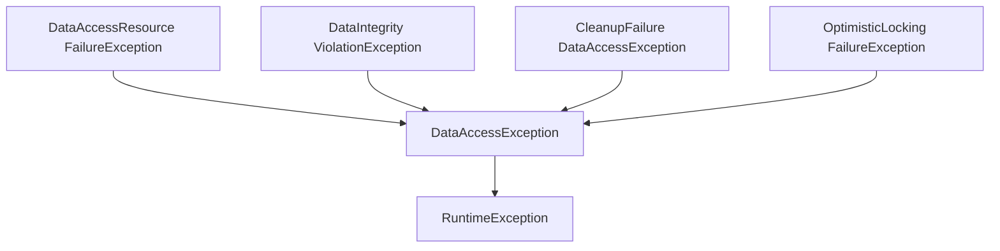

- Data Management
- Spring JDBC
- Transaction
-----
# Data Management
## The Role of Spring in Enterprise Data Access
 - Declarative **Transaction Management** by @Transactional 
 - **Template** Design Pattern
	  - JdbcTemplate
	  - JmsTemplate
	  - RestTemplate
	  - get data source manually
	```java
	  DataSourceUtils.getConnection(dataSource)
	  ```
- Data Access in a Layered Architecture
	- Service Layer (or application layer)
	- Data access Layer
	- Infrastructure Layer

## Spring's DataAccessExceptionHierarchy
- hides JPA/Hibernate/JDBC
- RuntimeException
- DataAccessException

## Using Test Databases
- Embedded Database Builder i.e. HSQL/H2/Derby
```Java
@Bean
public DataSource dataSource() {
EmbeddedDatabaseBuilder builder = new EmbeddedDatabaseBuilder();
return builder.setName("testdb")
.setType(EmbeddedDatabaseType.HSQL)
.addScript("classpath:/testdb/schema.db")
.addScript("classpath:/testdb/test-data.db").build();
}
```
- JDBC Namespace Equivalent
1. ```<jdbc:embedded-database>```
2. ```<jdbc:initialize-database>```
3. Java configuration on initializing and existing test DB
```java
@Configuration
public class DatabaseInitializer {
@Value("classpath:schema.sql") private Resource schemaScript;
@Value("classpath:test-data.sql") private Resource dataScript;
private DatabasePopulator databasePopulator() {
final ResourceDatabasePopulator populator =
new ResourceDatabasePopulator();
populator.addScript(schemaScript);
populator.addScript(dataScript);
return populator;
}
```

## Implementing Caching
## NoSQL databases
## Summary
– Enables layered architecture principles
• Higher layers should not know about data management
below
– Isolate via Data Access Exceptions
• Hierarchy makes them easier to handle
– Provides consistent transaction management
– Supports most leading data-access technologies
• Relational and non-relational (NoSQL)
– A key component of the core Spring libraries
– Automatic caching facility


----------


# Spring JDBC
## Spring’s JdbcTemplate

 1. implementing JDBC based repository
```java
public class JdbcCustomerRepository implements CustomerRepository {
private JdbcTemplate jdbcTemplate;
public JdbcCustomerRepository(DataSource dataSource) {
this.jdbcTemplate = new JdbcTemplate(dataSource);
}
public int getCustomerCount() {
String sql = "select count(*) from customer";
return jdbcTemplate.queryForObject(sql, Integer.class);
}
}
```

 2. Query execution
```java 
//1 Query with no bind variables
jdbcTemplate.queryForObject(sql, Date.class);
//2 Query With Bind Variables
public int getCountOfNationalsOver(Nationality nationality, int age) {
	String sql = "select count(*) from PERSON " +
	"where age > ? and nationality = ?";
	jdbcTemplate.queryForObject
	(sql, Integer.class, age, nationality.toString());
}
//3 Query for a single row
public Map<String,Object> getPersonInfo(int id) {
	String sql = "select * from PERSON where id=?";
	return jdbcTemplate.queryForMap(sql, id);
}
//4 Query for multiple rows
public List<Map<String,Object>> getAllPersonInfo() {
	String sql = "select * from PERSON";
	return jdbcTemplate.queryForList(sql);
}
```
3. Working with result sets
- map relational data into domain objects (ResultSet to Account)
- ORM alternative
- RowMapper
```java
public Person getPerson(int id) {
	return jdbcTemplate.queryForObject(
	"select first_name, last_name from PERSON where id=?",
	new PersonMapper(), id);
}
class PersonMapper implements RowMapper<Person> {
	public Person mapRow(ResultSet rs, int rowNum) throws SQLException{
		return new Person(rs.getString("first_name"),
		rs.getString("last_name"));
	}
}

public List<Person> getAllPersons() {
	return jdbcTemplate.query(
	"select first_name, last_name from PERSON",
	new PersonMapper());
}

public List<Person> getAllPersons() {
	return jdbcTemplate.query(
		"select first_name, last_name from PERSON",
		(rs, rowNum) -> {
		return new Person(rs.getString("first_name"),
		rs.getString("last_name"));
	});
}
```
- RowCallbackHandler 
	- no return object
	- streaming rows to a file, converting rows to XML, filtering rows (SQL filtering is better), faster than JPA equivalent
```java
public class JdbcOrderRepository {
public void generateReport(final PrintWriter out) {
// select all orders of year 2009 for a full report
jdbcTemplate.query("select * from order where year=?",
(RowCallbackHandler)(rs) ->
{ out.write( rs.getString("customer") … ); },
2016);
}
}
public interface RowCallbackHandler {
void processRow(ResultSet rs) throws SQLException;
}
```
- ResultSetExtractor
	- processing an entire ResultSet at once to a single object
	- You are responsible for iterating the ResultSet
```java
public class JdbcOrderRepository {
	public Order findByConfirmationNumber(String number) {
	// execute an outer join between order and item tables
		return jdbcTemplate.query(
		"select...from order o, item i...conf_id = ?",
		(ResultSetExtractor<Order>)(rs) -> {
			Order order = null;
			while (rs.next()) {
			if (order == null)
			order = new Order(rs.getLong("ID"), 
							  rs.getString("NAME"), ...);
			order.addItem(mapItem(rs));
			}
			return order;
		},
		number);
	}
}
```
- Summary of Callback Interfaces
• **RowMapper**
– Best choice when each row of a ResultSet maps to a
domain object
• **RowCallbackHandler**
– Best choice when no value should be returned from the
callback method for each row, especially large queries
• **ResultSetExtractor**
– Best choice when multiple rows of a ResultSet map to a
single object


----------

- **jdbcTemplate.update()**
```java
public int insertPerson(Person person) {
	return jdbcTemplate.update(
	“insert into PERSON (first_name, last_name, age)” +
	“values (?, ?, ?)”,
	person.getFirstName(),
	person.getLastName(),
	person.getAge());
}

public int updateAge(Person person) {
	return jdbcTemplate.update(
	“update PERSON set age=? where id=?”,
	person.getAge(),
	person.getId());
}
```
## Exception handling
>The *JdbcTemplate* transforms **SQLExceptions** into
**DataAccessExceptions**


## Summary
• JDBC is useful
– But using JDBC API directly is tedious and error-prone
• JdbcTemplate simplifies data access and enforces
consistency
– DRY principle hides most of the JDBC
– Many options for reading data
• SQLExceptions typically cannot be handled where
thrown
– Should not be checked Exceptions
– Spring provides DataAccessException instead


----------


# Transaction
 
| ACID | set of tasks take place as a single transaction|
|--|--|
|atomic|unit of work is all-or-nothing operation |
|consistent|db interity constaints are never voilated|
|isolated|isolating transactions from each other|
|durable|committed changes are permanent|
## Java Transaction Management
- jdbc, jms, jta, hibernate, jpa handle transaction differently and programatically in repository layer
- local transaction - single resource
- global/distributed transactions - separate transaction manager

## Spring Transaction Management
- Demarcation expressed declaratively via AOP
- **PlatformTransactionManager** implementations
	- DataSourceTransactionManager
	- HibernateTransactionManager
	- JpaTransactionManager
	- ...
- global and local use the same API
```java
public class RewardNetworkImpl implements RewardNetwork {
@Transactional
public RewardConfirmation rewardAccountFor(Dining d) {
// atomic unit-of-work
}
}
@Configuration
@EnableTransactionManagement
public class TxnConfig {
@Bean
public PlatformTransactionManager transactionManager(DataSource ds);
return new DataSourceTransactionManager(ds) {
}
//or
<tx:annotation-driven/>

<bean id=“transactionManager” class=”org.springframework.jdbc.datasource.DataSourceTransactionManager”>
	<property name=“dataSource” ref=“dataSource”/>
</bean>
```
- Target object wrapped in a proxy (Around advice)

[spring proxy ]--proxy wraps target object
-->((RewardNetworkImpl))

- @Transactional --class level and method level
```java
@Transactional(timeout=60)
public class RewardNetworkImpl implements RewardNetwork {
public RewardConfirmation rewardAccountFor(Dining d) {
// atomic unit-of-work
}
@Transactional(timeout=45)
public RewardConfirmation updateConfirmation(RewardConfirmantion rc) {
// atomic unit-of-work
}
}
```
##  Isolation Levels
```java
public class RewardNetworkImpl implements RewardNetwork {
	@Transactional (isolation=Isolation.READ_UNCOMMITTED)
	public BigDecimal totalRewards(String merchantNumber, int year)
	// Calculate total rewards for a restaurant for a whole year
	}
}
```
| isolation level |  | |
|--|--|--|
| READ_UNCOMMITTED | dirty reads  |lowest level|
|READ_COMMITTED|no dirty reads| default for most db|
|REPEATABLE_READ|no dirty reads, non-repeatable reads prevented|
|SERIALIZABLE|non-repeatable reads prevented, no phantom reads| highest level
- dirty reads : see the results of an uncommited unit of work
- non-repeatable reads : a row is read twice in the same transaction, results are different
## Transaction Propagation
```java
@Transactional( propagation=Propagation.REQUIRES_NEW )
```
| Propagation | meaning |
|--|--|
|REQUIRED|  Execute within a current transaction, create a new one if none exists|
|REQUIRES_NEW |Create a new transaction, suspending the current transaction if one exists

## Rollback rules
```java
@Transactional(rollbackFor=MyCheckedException.class,
noRollbackFor={JmxException.class, MailException.class})
```
- By default, a transaction is rolled back if a RuntimeException (DataAccessException, any runtimeException) has been thrown
## Testing
- by default , **@Transaction** will be rolled back after testing 
- with **@Commit** , transaction will be committed
```java
@ContextConfiguration(classes=RewardsConfig.class)
@RunWith(SpringJUnit4ClassRunner.class)
public class RewardNetworkTest {
	@Test @Transactional //@Commit
	public void testRewardAccountFor() {
		...
	}
}
```

## Advanced topics
### XML configuration
```java
<aop:config>
<aop:pointcut id=“rewardNetworkMethods”
expression=“execution(* rewards.RewardNetwork.*(..))”/>
<aop:advisor pointcut-ref=“rewardNetworkMethods” advice-ref=“txAdvice”/>
</aop:config>
<tx:advice id=“txAdvice”>
<tx:attributes>
<tx:method name="get*" read-only="true" timeout="10"/>
<tx:method name="find*" read-only="true" timeout="10"/>
<tx:method name="*" timeout="30"/>
</tx:attributes>
</tx:advice>
<bean id=“transactionManager”
class=“org.springframework.jdbc.datasource.DataSourceTransactionManager”>
<property name=“dataSource” ref=“dataSource”/>
</bean>
```
### Programmatic transactions
- declarative transaction management is recommended, but programmatic transaction is enabled too. 
- use TransactionTemplate plus callback, working with JTA transaction manager or local
```java
public RewardConfirmation rewardAccountFor(Dining dining) {
...
	return new TransactionTemplate(txManager).execute( (status) -> {
	try {
	...
		accountRepository.updateBeneficiaries(account);
		confirmation = rewardRepository.confirmReward(contribution, dining);
	}
	catch (RewardException e) {
		status.setRollbackOnly();
		confirmation = new RewardFailure();
	}
		return confirmation;
	}
	);
}
```
### Read-only transactions
- put multiple connections in one readOnly transaction
```java
@Transactional(readOnly=true)
public void rewardAccount2() {
jdbcTemplate.queryForList(…);
jdbcTemplate.queryForInt(…);
}
```
- With a high isolation level, a read-only transaction prevents
data from being modified until the transaction commits
```java
@Transactional(readOnly=true, isolation=Isolation.REPEATABLE_READ)
```
### More on Transactional Tests
- @Before test runs within a transaction
- @BeforeTransaction test runs before a transaction starts
- @After test runs within a transaction
- @AfterTransaction test runs after a transaction starts
```java
@ContextConfiguration(locations={"/rewards-config.xml"})
@RunWith(SpringJUnit4ClassRunner.class)
public class RewardNetworkTest {
@BeforeTransaction
public void verifyInitialDatabaseState() {…}
@Before
public void setUpTestDataInTransaction() {…}
@Test @Transactional
public void testRewardAccountFor() { … }
```
-
### Mutiple Transactions
```java
@Transactional("myOtherTransactionManager")
@Transactional //default transactionManager
```
### Propagation Options

